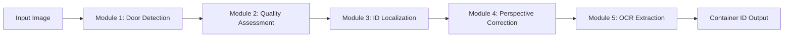
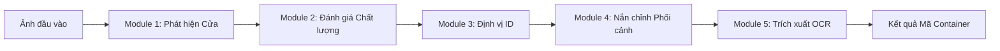

# Container ID Extraction Research / Nghiên cứu Trích xuất Mã số Container

[](https://www.python.org/downloads/)
[](https://dvc.org/)
[](LICENSE)
[]()

**English** | [Tiếng Việt](#tiếng-việt)

---

## English

### Overview

This research project develops an end-to-end computer vision system for **automated container ID extraction** from images of **container doors**. The system is designed for SOWATCO company to streamline container identification in logistics operations.

In real-world deployment scenarios, users upload various images to the system. Before extracting container IDs, we must first detect and classify whether images contain container doors, assess image quality, localize the ID region, correct perspective distortion, and finally perform text extraction.

The project outputs trained models optimized for production deployment in a separate backend service.

### System Architecture

The solution implements a **5-stage modular pipeline**:



#### Module Descriptions

1. **Module 1: Container Door Detection**
   - **Purpose**: Detect and classify container door objects in images
   - **Technology**: YOLOv11-Nano/Small
   - **Input**: Raw image
   - **Output**: Bounding box coordinates of container door

2. **Module 2: Image Quality Assessment**
   - **Purpose**: Evaluate image quality (blur, lighting, size)
   - **Technology**: Custom quality metrics / Lightweight classifier
   - **Input**: Cropped container door image
   - **Output**: Quality score and pass/fail decision

3. **Module 3: Container ID Localization**
   - **Purpose**: Predict 4-point polygon enclosing the container ID region
   - **Technology**: YOLOv11-Pose
   - **Input**: Container door image
   - **Output**: 4 keypoint coordinates (top-left, top-right, bottom-right, bottom-left)

4. **Module 4: Perspective Correction**
   - **Purpose**: Apply perspective transform to straighten the ID region
   - **Technology**: OpenCV perspective warp + quality assessment
   - **Input**: 4 keypoints from Module 3
   - **Output**: Rectified ID region image

5. **Module 5: OCR Extraction**
   - **Purpose**: Extract container ID text from rectified image
   - **Technology**: OCR engine (PaddleOCR / EasyOCR / Custom)
   - **Input**: Rectified ID image
   - **Output**: Container ID string (validated format)

### Technology Stack

- **Language**: Python 3.11
- **Deep Learning**: YOLOv11 (Ultralytics), PyTorch
- **Data Versioning**: DVC with Google Drive backend
- **Experiment Tracking**: Weights & Biases (wandb)
- **Dependency Management**: uv
- **Computer Vision**: OpenCV, Albumentations
- **Data Analysis**: Pandas, NumPy, Matplotlib, Seaborn

---

## Table of Contents

- [Overview](#overview)
- [System Architecture](#system-architecture)
- [Project Structure](#project-structure)
- [Installation & Setup](#installation--setup)
- [Data Management](#data-management)
- [Usage](#usage)
  - [Data Preparation](#data-preparation)
  - [Training Individual Modules](#training-individual-modules)
  - [Running Full Pipeline](#running-full-pipeline)
  - [Notebooks](#notebooks)
- [Experiment Tracking](#experiment-tracking)
- [Model Artifacts](#model-artifacts)
- [Development Guidelines](#development-guidelines)
- [Documentation](#documentation)
- [Roadmap](#roadmap)
- [Contributing](#contributing)
- [License & Acknowledgments](#license--acknowledgments)

---

## Project Structure

This repository follows a strict separation of concerns as defined in [.github/instructions/project_structure.instructions.md](.github/instructions/project_structure.instructions.md).

```text
container-id-research/
├── .github/
│   ├── instructions/       # Agent Rules (Single Source of Truth)
│   └── prompts/
│
├── artifacts/              # [GIT IGNORE] Automated Outputs
│   └── [module_name]/      # Organized by Module (e.g., detection, ocr)
│       └── [experiment_id]/
│           ├── weights/
│           └── results.csv
│
├── data/                   # [DVC Managed]
│   └── processed/
│       └── [module_name]/  # Example: detection
│           ├── images/
│           ├── labels/
│           └── data.yaml   # <--- CRITICAL: Data config resides with data
│
├── demos/                  # Interactive Research Apps
│   └── [module_name]/      # Example: detection
│       ├── app.py          # Entry point (Gradio/Streamlit)
│       └── samples/        # Test images specific to this demo
│
├── docs/                   # Documentation Center
│   ├── guidelines/         # Labeling & SOPs
│   ├── reports/            # Technical Reports
│   └── structure.md
│
├── experiments/            # [INPUT] Hyperparameter Configs
│   ├── 001_det_baseline.yaml   # Naming: [id]_[module]_[description].yaml
│   └── ...
│
├── notebooks/              # Sandbox for EDA & Prototyping
│   ├── 01_eda_detection.ipynb
│   └── ...
│
├── scripts/                # Standalone Utility Scripts
│   ├── kaggle/             # Remote training scripts
│   ├── data_processing/    # One-off conversion scripts
│   └── utils/
│
├── src/                    # [LIBRARY] Reusable Core Logic (No execution code)
│   ├── __init__.py
│   ├── [module_name]/      # Example: detection
│   │   ├── __init__.py
│   │   ├── model.py        # Architecture definition
│   │   ├── dataset.py      # Custom Dataloader
│   │   └── trainer.py      # Training loop logic
│   └── utils/              # Shared utilities (geometry, visualization)
│
├── tests/                  # Unit Tests mirroring src structure
├── .env                    # Secrets (API Keys)
├── dvc.yaml                # DVC Pipeline
├── pyproject.toml          # Dependency Management
└── README.md
```

### Directory Explanations

- **`src/` (The Library)**: Contains the core business logic and reusable components. Code here must be importable.
- **`experiments/` (The Configuration)**: Stores the "DNA" of every training run. A single YAML file must fully define an experiment.
- **`data/`**: All datasets managed by DVC. `raw/` contains original images, `interim/` holds stratified splits, `processed/` contains YOLO-formatted data.
- **`artifacts/` (The Output)**: Stores generated files (weights, logs, plots). This directory is git-ignored.
- **`scripts/` (The Executors)**: Entry points for execution. Scripts should import logic from `src` and configuration from `experiments`.
- **`notebooks/` (The Sandbox)**: Exploratory Data Analysis (EDA), prototyping, and visualization.
- **`demos/` (The Showcase)**: Interactive applications (Gradio/Streamlit) to demonstrate model capabilities.
- **`docs/`**: Documentation Center including guidelines, reports, and structure definitions.
- **`.github/`**: Contains agent instructions and prompts, serving as the single source of truth for project rules.

---

## Installation & Setup

### Prerequisites

- **Python 3.11** (required)
- **uv** (dependency manager)
- **Git** (version control)
- **DVC** (data version control)
- **Google Drive account** (for data access)

### Step-by-Step Installation

1. **Clone the repository**

```bash
git clone <repository-url>
cd container-id-research
```

2. **Install dependencies with uv**

```bash
# Install uv if not already installed
pip install uv

# Install project dependencies
uv sync
```

3. **Activate virtual environment**

```bash
# Windows
.venv\Scripts\activate

# Linux/macOS
source .venv/bin/activate
```

4. **Setup DVC and pull data**

```bash
# Initialize DVC (if needed)
dvc remote default storage

# Pull data from Google Drive
dvc pull
```

5. **Verify installation**

```bash
# Check Python version
python --version  # Should show 3.11.x

# Verify DVC data
ls data/raw/  # Should show images
```

---

## Data Management

### Dataset Overview

- **Total Images**: 831
- **Categories**: 2 (container_door, container_id)
- **Annotations**: 989 total (500 doors, 489 IDs)
- **Format**: COCO JSON for annotations, JPEG/PNG for images
- **Storage**: Google Drive via DVC

### Data Versioning with DVC

This project uses **DVC (Data Version Control)** to manage large datasets and model weights efficiently.

**Key DVC Files**:
- `data/raw.dvc`: Tracks the raw data directory
- `.dvc/config`: DVC remote configuration (Google Drive)
- `dvc.yaml`: DVC pipeline for data processing stages

**Common DVC Commands**:

```bash
# Pull latest data from remote
dvc pull

# Check data status
dvc status

# Reproduce entire pipeline
dvc repro

# Push new data to remote
dvc add data/raw
dvc push
```

### Data Stratification Methodology

The project employs **Label Powerset Stratification with Rare-Class Aggregation** to ensure balanced representation of edge cases in train/val/test splits.

**Key Features**:
- Stratification based on image attributes (lighting, angle, occlusion, surface, sharpness)
- Priority-based grouping (hard, tricky, common)
- Singleton handling with controlled augmentation
- Ratios: 70% Train, 15% Validation, 15% Test

📚 **Detailed methodology**: See [`docs/modules/module-1-detection/data-splitting-methodology.md`](docs/modules/module-1-detection/data-splitting-methodology.md)

---

## Usage

### Data Preparation

Run the DVC pipeline to process raw data and generate YOLO-formatted datasets:

```bash
# Execute full data pipeline
dvc repro

# Or run specific stages
dvc repro split_data
dvc repro convert_detection
dvc repro convert_localization
```

### Training Individual Modules

#### Module 1: Container Door Detection

**Local Training:**
```bash
# Train YOLOv11 detection model
python src/detection/train_and_evaluate.py --config experiments/001_det_baseline.yaml
```

**Kaggle Training (Recommended):**
> 📌 For GPU-accelerated training on Kaggle (free T4/P100 GPUs), see: [**Kaggle Training Guide**](KAGGLE_TRAINING_GUIDE.md)
>
> The guide includes:
> - Direct notebook workflow (single-cell execution)
> - DVC session token setup (automatic model sync)
> - WandB integration for experiment tracking
> - Expected results: mAP@50 > 0.90, inference < 50ms

#### Module 3: Container ID Localization

```bash
# Train YOLOv11 pose model
python src/localization/train.py --config experiments/localization/exp001_baseline/config.yaml

# Run inference
python src/localization/inference.py --weights artifacts/localization/best.pt --source test_images/
```

### Running Full Pipeline

Execute the end-to-end pipeline on a single image or batch:

```bash
# Single image
python src/pipeline/full_pipeline.py --input path/to/image.jpg --output results/

# Batch processing
python src/pipeline/full_pipeline.py --input path/to/folder/ --output results/ --batch
```

### Notebooks

Explore data and visualize results using Jupyter notebooks:

```bash
# Launch Jupyter
jupyter notebook

# Available notebooks:
# - 01-annotated-image-eda.ipynb: Dataset exploration and statistics
# - 02-module1-detection-analysis.ipynb: Detection results analysis
# - 03-module3-localization-analysis.ipynb: Localization evaluation
# - 04-end-to-end-pipeline-demo.ipynb: Full pipeline demonstration
```

---

## Experiment Tracking

### Weights & Biases Integration

This project uses **wandb** for experiment tracking and visualization.

**Setup**:

```bash
# Login to wandb
wandb login

# Your experiments will be automatically logged
```

**Experiment Naming Convention**:

```
<module>_exp<number>_<description>

Examples:
- detection_exp001_yolo11n_baseline
- detection_exp002_yolo11s_augmented
- localization_exp001_yolo11_pose_baseline
```

**Tracked Metrics**:
- Training/validation loss curves
- mAP@50, mAP@50-95 (detection)
- OKS (Object Keypoint Similarity) for pose
- Inference time and FPS
- Model hyperparameters
- Dataset statistics

**Access Results**:
- Visit your wandb dashboard: `https://wandb.ai/<your-username>/container-id-research`
- Local results saved in `experiments/<module>/exp<number>/`

---

## Model Artifacts

### Model Storage

Trained models are stored in the `artifacts/` directory, organized by module:

```
artifacts/
├── detection/
│   └── exp001/
│       ├── weights/
│       │   ├── best.pt
│       │   └── last.pt
│       └── results.csv
└── localization/
    └── exp001/
        └── weights/
            ├── best.pt
            └── last.pt
```

### Model Versioning Strategy

- **Git**: Track model metadata and configuration files
- **DVC**: Track large model weight files (`.pt` files)
- **wandb**: Track experiment history and model performance

### Exporting for Production

```bash
# Export models with metadata
python scripts/export_models.py --module detection --version v1.0

# Output: Packaged model ready for backend integration
```

### Performance Benchmarks

_(To be updated as training progresses)_

| Module          | Model        | mAP@50 | mAP@50-95 | Inference Time | Size |
| --------------- | ------------ | ------ | --------- | -------------- | ---- |
| Door Detection  | YOLOv11n     | TBD    | TBD       | TBD            | TBD  |
| ID Localization | YOLOv11-Pose | TBD    | TBD       | TBD            | TBD  |

---

## Development Guidelines

### Code Style

- **PEP 8**: Follow Python style guidelines
- **Black**: Code formatter (line length: 88)
- **isort**: Import sorting
- **Type hints**: Use type annotations where applicable

```bash
# Format code
black src/
isort src/

# Check style
flake8 src/
```

### Conventional Commits

This project follows **Unified Conventional Commits Standard (UCCS)**.

**Commit format**:
```
<type>(<scope>): <description>

[optional body]
```

**Types**:
- `feat`: New feature or capability
- `fix`: Bug fix or correction
- `refactor`: Code restructuring without behavior change
- `docs`: Documentation updates
- `style`: Code formatting (no logic change)
- `chore`: Maintenance tasks (dependencies, configs)

📚 **Full guidelines**: [`docs/general/conventional-commit-guideline.md`](docs/general/conventional-commit-guideline.md)

### Branch Strategy

- `main`: Production-ready code
- `develop`: Integration branch
- `feature/*`: New features
- `fix/*`: Bug fixes
- `experiment/*`: Experimental work

### Pull Request Workflow

1. Create feature branch from `develop`
2. Make changes with conventional commits
3. Write/update tests
4. Submit PR with clear description
5. Pass CI checks and code review
6. Merge to `develop`

### Testing Requirements

```bash
# Run all tests
pytest tests/

# Run specific module tests
pytest tests/test_detection.py

# Generate coverage report
pytest --cov=src tests/
```

---

## Documentation

### Available Documentation

#### General
- [Conventional Commit Guidelines](docs/general/conventional-commit-guideline.md)
- [System Architecture](docs/general/architecture.md) _(To be created)_

#### Data Labeling
- [Attribute Annotation Guideline](docs/data-labeling/attribute-annotation-guideline.md)
- [Container Door Labeling Guideline](docs/data-labeling/container-door-labeling-guideline.md)
- [Container ID Labeling Guideline](docs/data-labeling/id-container-labeling-guideline.md)

#### Module-Specific
- **Module 1 (Detection)**:
  - [Data Splitting Methodology](docs/modules/module-1-detection/data-splitting-methodology.md)
  - [Technical Specification: Data Splitting](docs/modules/module-1-detection/technical-specification-data-splitting.md)
  - [Training Guide](docs/modules/module-1-detection/training-guide.md) _(To be created)_

---

## Roadmap

### Current Status

- ✅ Data collection and annotation (831 images)
- ✅ Data labeling guidelines established
- ✅ Data stratification methodology designed
- ✅ EDA and dataset analysis complete
- 🟡 Module 1 (Detection) - In development
- 🟡 Module 3 (Localization) - In development

### Upcoming Milestones

- [ ] Complete Module 1 training and evaluation
- [ ] Complete Module 3 training and evaluation
- [ ] Implement Module 2 (Quality Assessment)
- [ ] Implement Module 4 (Perspective Correction)
- [ ] Implement Module 5 (OCR Extraction)
- [ ] End-to-end pipeline integration and testing
- [ ] Performance optimization and benchmarking
- [ ] Production deployment preparation
- [ ] Backend service integration

### Future Enhancements

- Real-time video processing
- Multi-container detection in single image
- Mobile deployment (TensorFlow Lite / ONNX)
- API service with FastAPI
- Continuous learning pipeline

---

## Contributing

### How to Contribute

We welcome contributions! Here's how you can help:

1. **Report Issues**: Use GitHub Issues for bug reports and feature requests
2. **Submit Pull Requests**: Follow the PR workflow outlined above
3. **Improve Documentation**: Fix typos, add examples, clarify explanations
4. **Share Ideas**: Discuss improvements in GitHub Discussions

### Contact

- **Project Lead**: duyhxm
- **Organization**: SOWATCO Company
- **Email**: _(Add if applicable)_

---

## License & Acknowledgments

### License

This project is licensed under the **MIT License**. See [LICENSE](LICENSE) file for details.

### Acknowledgments

- **SOWATCO Company** for project sponsorship and domain expertise
- **Ultralytics** for the YOLOv11 framework
- **DVC Team** for data versioning tools
- **Weights & Biases** for experiment tracking platform
- **CVAT** for annotation tools
- Open-source community for libraries: OpenCV, PyTorch, Albumentations

### References

- [YOLOv11 Documentation](https://docs.ultralytics.com/)
- [DVC Documentation](https://dvc.org/doc)
- [Weights & Biases Documentation](https://docs.wandb.ai/)
- [COCO Dataset Format](https://cocodataset.org/#format-data)

---

# Tiếng Việt

## Tổng quan

Dự án nghiên cứu này phát triển một hệ thống thị giác máy tính end-to-end để **tự động trích xuất mã số container** từ hình ảnh **cửa sau container**. Hệ thống được thiết kế cho công ty SOWATCO nhằm tối ưu hóa quy trình nhận diện container trong hoạt động logistics.

Trong môi trường triển khai thực tế, người dùng tải lên nhiều loại hình ảnh khác nhau. Trước khi trích xuất mã số container, chúng ta phải phát hiện và phân loại xem ảnh có chứa cửa container không, đánh giá chất lượng ảnh, định vị vùng chứa mã số, nắn chỉnh phối cảnh, và cuối cùng thực hiện trích xuất văn bản.

Sản phẩm đầu ra của dự án là các model được huấn luyện tối ưu để triển khai trong một dịch vụ backend riêng biệt.

## Kiến trúc Hệ thống

Giải pháp triển khai **pipeline 5 giai đoạn modular**:



### Mô tả các Module

1. **Module 1: Phát hiện Cửa Container**
   - **Mục đích**: Phát hiện và phân loại đối tượng cửa container trong ảnh
   - **Công nghệ**: YOLOv11-Nano/Small
   - **Đầu vào**: Ảnh gốc
   - **Đầu ra**: Tọa độ bounding box của cửa container

2. **Module 2: Đánh giá Chất lượng Ảnh**
   - **Mục đích**: Đánh giá chất lượng ảnh (độ mờ, ánh sáng, kích thước)
   - **Công nghệ**: Chỉ số chất lượng tùy chỉnh / Classifier nhẹ
   - **Đầu vào**: Ảnh cửa container đã crop
   - **Đầu ra**: Điểm chất lượng và quyết định pass/fail

3. **Module 3: Định vị Mã số Container**
   - **Mục đích**: Dự đoán đa giác 4 điểm bao quanh vùng chứa mã container
   - **Công nghệ**: YOLOv11-Pose
   - **Đầu vào**: Ảnh cửa container
   - **Đầu ra**: 4 tọa độ keypoint (trên-trái, trên-phải, dưới-phải, dưới-trái)

4. **Module 4: Nắn chỉnh Phối cảnh**
   - **Mục đích**: Áp dụng biến đổi phối cảnh để làm thẳng vùng ID
   - **Công nghệ**: OpenCV perspective warp + đánh giá chất lượng
   - **Đầu vào**: 4 keypoint từ Module 3
   - **Đầu ra**: Ảnh vùng ID đã được nắn chỉnh

5. **Module 5: Trích xuất OCR**
   - **Mục đích**: Trích xuất văn bản mã container từ ảnh đã nắn chỉnh
   - **Công nghệ**: OCR engine (PaddleOCR / EasyOCR / Custom)
   - **Đầu vào**: Ảnh ID đã nắn chỉnh
   - **Đầu ra**: Chuỗi mã container (định dạng đã validate)

## Ngăn xếp Công nghệ

- **Ngôn ngữ**: Python 3.11
- **Deep Learning**: YOLOv11 (Ultralytics), PyTorch
- **Quản lý phiên bản dữ liệu**: DVC với Google Drive backend
- **Theo dõi thực nghiệm**: Weights & Biases (wandb)
- **Quản lý dependencies**: uv
- **Computer Vision**: OpenCV, Albumentations
- **Phân tích dữ liệu**: Pandas, NumPy, Matplotlib, Seaborn

---

## Mục lục

- [Tổng quan](#tổng-quan)
- [Kiến trúc Hệ thống](#kiến-trúc-hệ-thống)
- [Cấu trúc Dự án](#cấu-trúc-dự-án)
- [Cài đặt & Thiết lập](#cài-đặt--thiết-lập)
- [Quản lý Dữ liệu](#quản-lý-dữ-liệu)
- [Sử dụng](#sử-dụng)
- [Theo dõi Thực nghiệm](#theo-dõi-thực-nghiệm)
- [Sản phẩm Model](#sản-phẩm-model)
- [Hướng dẫn Phát triển](#hướng-dẫn-phát-triển)
- [Tài liệu](#tài-liệu)
- [Lộ trình](#lộ-trình)
- [Đóng góp](#đóng-góp)
- [Giấy phép & Ghi nhận](#giấy-phép--ghi-nhận)

---

## Cấu trúc Dự án

Dự án này tuân thủ nghiêm ngặt việc phân tách các mối quan tâm như được định nghĩa trong [.github/instructions/project_structure.instructions.md](.github/instructions/project_structure.instructions.md).

```text
container-id-research/
├── .github/
│   ├── instructions/       # Quy tắc Agent (Nguồn sự thật duy nhất)
│   └── prompts/
│
├── artifacts/              # [GIT IGNORE] Đầu ra tự động
│   └── [module_name]/      # Tổ chức theo Module (vd: detection, ocr)
│       └── [experiment_id]/
│           ├── weights/
│           └── results.csv
│
├── data/                   # [DVC Managed]
│   └── processed/
│       └── [module_name]/  # Vd: detection
│           ├── images/
│           ├── labels/
│           └── data.yaml   # <--- QUAN TRỌNG: Config dữ liệu nằm cùng dữ liệu
│
├── demos/                  # Ứng dụng nghiên cứu tương tác
│   └── [module_name]/      # Vd: detection
│       ├── app.py          # Điểm nhập (Gradio/Streamlit)
│       └── samples/        # Ảnh test cụ thể cho demo này
│
├── docs/                   # Trung tâm Tài liệu
│   ├── guidelines/         # Hướng dẫn gán nhãn & SOPs
│   ├── reports/            # Báo cáo kỹ thuật
│   └── structure.md
│
├── experiments/            # [INPUT] Cấu hình Hyperparameter
│   ├── 001_det_baseline.yaml   # Đặt tên: [id]_[module]_[description].yaml
│   └── ...
│
├── notebooks/              # Sandbox cho EDA & Prototyping
│   ├── 01_eda_detection.ipynb
│   └── ...
│
├── scripts/                # Scripts tiện ích độc lập
│   ├── kaggle/             # Scripts training từ xa
│   ├── data_processing/    # Scripts chuyển đổi một lần
│   └── utils/
│
├── src/                    # [THƯ VIỆN] Logic cốt lõi tái sử dụng (Không code thực thi)
│   ├── __init__.py
│   ├── [module_name]/      # Vd: detection
│   │   ├── __init__.py
│   │   ├── model.py        # Định nghĩa kiến trúc
│   │   ├── dataset.py      # Custom Dataloader
│   │   └── trainer.py      # Logic vòng lặp training
│   └── utils/              # Tiện ích chia sẻ (hình học, trực quan hóa)
│
├── tests/                  # Unit Tests phản chiếu cấu trúc src
├── .env                    # Secrets (API Keys)
├── dvc.yaml                # DVC Pipeline
├── pyproject.toml          # Quản lý Dependency
└── README.md
```

### Giải thích Thư mục

- **`src/` (Thư viện)**: Chứa logic nghiệp vụ cốt lõi và các thành phần tái sử dụng. Code ở đây phải có thể import được.
- **`experiments/` (Cấu hình)**: Lưu trữ "DNA" của mỗi lần chạy training. Một file YAML duy nhất phải định nghĩa đầy đủ một thực nghiệm.
- **`data/`**: Tất cả datasets được quản lý bởi DVC. `raw/` chứa ảnh gốc, `interim/` chứa các split đã phân tầng, `processed/` chứa dữ liệu định dạng YOLO.
- **`artifacts/` (Đầu ra)**: Lưu trữ các file được tạo ra (trọng số, logs, biểu đồ). Thư mục này được git-ignore.
- **`scripts/` (Người thực thi)**: Điểm nhập để thực thi. Scripts nên import logic từ `src` và cấu hình từ `experiments`.
- **`notebooks/` (Sandbox)**: Phân tích dữ liệu khám phá (EDA), tạo mẫu và trực quan hóa.
- **`demos/` (Trưng bày)**: Các ứng dụng tương tác (Gradio/Streamlit) để demo khả năng của model.
- **`docs/`**: Trung tâm tài liệu bao gồm hướng dẫn, báo cáo và định nghĩa cấu trúc.
- **`.github/`**: Chứa hướng dẫn và prompts cho agent, đóng vai trò là nguồn sự thật duy nhất cho các quy tắc dự án.

---

## Cài đặt & Thiết lập

### Yêu cầu

- **Python 3.11** (bắt buộc)
- **uv** (quản lý dependencies)
- **Git** (version control)
- **DVC** (data version control)
- **Tài khoản Google Drive** (để truy cập dữ liệu)

### Hướng dẫn Cài đặt Chi tiết

1. **Clone repository**

```bash
git clone <repository-url>
cd container-id-research
```

2. **Cài đặt dependencies với uv**

```bash
# Cài đặt uv nếu chưa có
pip install uv

# Cài đặt dependencies của dự án
uv sync
```

3. **Kích hoạt môi trường ảo**

```bash
# Windows
.venv\Scripts\activate

# Linux/macOS
source .venv/bin/activate
```

4. **Thiết lập DVC và tải dữ liệu**

```bash
# Khởi tạo DVC (nếu cần)
dvc remote default storage

# Tải dữ liệu từ Google Drive
dvc pull
```

5. **Kiểm tra cài đặt**

```bash
# Kiểm tra phiên bản Python
python --version  # Phải hiển thị 3.11.x

# Kiểm tra dữ liệu DVC
ls data/raw/  # Phải hiển thị ảnh
```

---

## Quản lý Dữ liệu

### Tổng quan Dataset

- **Tổng số ảnh**: 831
- **Danh mục**: 2 (container_door, container_id)
- **Annotations**: 989 tổng (500 cửa, 489 ID)
- **Định dạng**: COCO JSON cho annotations, JPEG/PNG cho ảnh
- **Lưu trữ**: Google Drive qua DVC

### Quản lý phiên bản Dữ liệu với DVC

Dự án này sử dụng **DVC (Data Version Control)** để quản lý datasets lớn và trọng số model hiệu quả.

**Các file DVC quan trọng**:
- `data/raw.dvc`: Theo dõi thư mục dữ liệu gốc
- `.dvc/config`: Cấu hình DVC remote (Google Drive)
- `dvc.yaml`: DVC pipeline cho các giai đoạn xử lý dữ liệu

**Lệnh DVC thông dụng**:

```bash
# Tải dữ liệu mới nhất từ remote
dvc pull

# Kiểm tra trạng thái dữ liệu
dvc status

# Tái tạo toàn bộ pipeline
dvc repro

# Đẩy dữ liệu mới lên remote
dvc add data/raw
dvc push
```

### Phương pháp Phân tầng Dữ liệu

Dự án áp dụng **Phân tầng dựa trên Label Powerset với Gộp nhóm Rare-Class** để đảm bảo đại diện cân bằng các trường hợp biên trong train/val/test splits.

**Đặc điểm chính**:
- Phân tầng dựa trên thuộc tính ảnh (ánh sáng, góc, che khuất, bề mặt, độ nét)
- Gom nhóm theo ưu tiên (hard, tricky, common)
- Xử lý singleton với augmentation có kiểm soát
- Tỷ lệ: 70% Train, 15% Validation, 15% Test

📚 **Phương pháp chi tiết**: Xem [`docs/modules/module-1-detection/data-splitting-methodology.md`](docs/modules/module-1-detection/data-splitting-methodology.md)

---

## Sử dụng

### Chuẩn bị Dữ liệu

Chạy DVC pipeline để xử lý dữ liệu gốc và tạo datasets định dạng YOLO:

```bash
# Thực thi toàn bộ data pipeline
dvc repro

# Hoặc chạy các giai đoạn cụ thể
dvc repro split_data
dvc repro convert_detection
dvc repro convert_localization
```

### Huấn luyện các Module Riêng lẻ

#### Module 1: Phát hiện Cửa Container

```bash
# Huấn luyện YOLOv11 detection model
python src/detection/train_and_evaluate.py --config experiments/001_det_baseline.yaml
```

#### Module 3: Định vị Mã số Container

```bash
# Huấn luyện YOLOv11 pose model
python src/localization/train.py --config experiments/localization/exp001_baseline/config.yaml

# Chạy inference
python src/localization/inference.py --weights artifacts/localization/best.pt --source test_images/
```

### Chạy Pipeline Đầy đủ

Thực thi pipeline end-to-end trên một ảnh hoặc batch:

```bash
# Một ảnh
python src/pipeline/full_pipeline.py --input path/to/image.jpg --output results/

# Xử lý batch
python src/pipeline/full_pipeline.py --input path/to/folder/ --output results/ --batch
```

### Notebooks

Khám phá dữ liệu và trực quan hóa kết quả bằng Jupyter notebooks:

```bash
# Khởi động Jupyter
jupyter notebook

# Notebooks có sẵn:
# - 01-annotated-image-eda.ipynb: Khám phá dataset và thống kê
# - 02-module1-detection-analysis.ipynb: Phân tích kết quả detection
# - 03-module3-localization-analysis.ipynb: Đánh giá localization
# - 04-end-to-end-pipeline-demo.ipynb: Demo pipeline đầy đủ
```

---

## Theo dõi Thực nghiệm

### Tích hợp Weights & Biases

Dự án này sử dụng **wandb** để theo dõi và trực quan hóa thực nghiệm.

**Thiết lập**:

```bash
# Đăng nhập wandb
wandb login

# Các thực nghiệm sẽ tự động được log
```

**Quy ước Đặt tên Thực nghiệm**:

```
<module>_exp<số>_<mô_tả>

Ví dụ:
- detection_exp001_yolo11n_baseline
- detection_exp002_yolo11s_augmented
- localization_exp001_yolo11_pose_baseline
```

**Chỉ số được Theo dõi**:
- Đường cong loss training/validation
- mAP@50, mAP@50-95 (detection)
- OKS (Object Keypoint Similarity) cho pose
- Thời gian inference và FPS
- Hyperparameters của model
- Thống kê dataset

**Truy cập Kết quả**:
- Truy cập wandb dashboard: `https://wandb.ai/<tên-người-dùng>/container-id-research`
- Kết quả local được lưu trong `experiments/<module>/exp<số>/`

---

## Sản phẩm Model

### Lưu trữ Model

Các model đã train được lưu trong thư mục `artifacts/`, tổ chức theo module:

```
artifacts/
├── detection/
│   └── exp001/
│       ├── weights/
│       │   ├── best.pt
│       │   └── last.pt
│       └── results.csv
└── localization/
    └── exp001/
        └── weights/
            ├── best.pt
            └── last.pt
```

### Chiến lược Phiên bản Model

- **Git**: Theo dõi metadata và file cấu hình model
- **DVC**: Theo dõi file trọng số model lớn (`.pt` files)
- **wandb**: Theo dõi lịch sử thực nghiệm và hiệu năng model

### Xuất cho Production

```bash
# Xuất models với metadata
python scripts/export_models.py --module detection --version v1.0

# Output: Model được đóng gói sẵn sàng cho tích hợp backend
```

### Benchmark Hiệu năng

_(Sẽ được cập nhật khi quá trình training hoàn thành)_

| Module        | Model        | mAP@50 | mAP@50-95 | Thời gian Inference | Kích thước |
| ------------- | ------------ | ------ | --------- | ------------------- | ---------- |
| Phát hiện Cửa | YOLOv11n     | TBD    | TBD       | TBD                 | TBD        |
| Định vị ID    | YOLOv11-Pose | TBD    | TBD       | TBD                 | TBD        |

---

## Hướng dẫn Phát triển

### Phong cách Code

- **PEP 8**: Tuân thủ hướng dẫn style Python
- **Black**: Code formatter (độ dài dòng: 88)
- **isort**: Sắp xếp import
- **Type hints**: Sử dụng type annotations khi có thể

```bash
# Format code
black src/
isort src/

# Kiểm tra style
flake8 src/
```

### Conventional Commits

Dự án này tuân theo **Unified Conventional Commits Standard (UCCS)**.

**Định dạng commit**:
```
<type>(<scope>): <description>

[optional body]
```

**Types**:
- `feat`: Tính năng hoặc khả năng mới
- `fix`: Sửa lỗi hoặc hiệu chỉnh
- `refactor`: Tái cấu trúc code không thay đổi hành vi
- `docs`: Cập nhật tài liệu
- `style`: Format code (không thay đổi logic)
- `chore`: Tác vụ bảo trì (dependencies, configs)

📚 **Hướng dẫn đầy đủ**: [`docs/general/conventional-commit-guideline.md`](docs/general/conventional-commit-guideline.md)

### Chiến lược Branch

- `main`: Code sẵn sàng production
- `develop`: Branch tích hợp
- `feature/*`: Tính năng mới
- `fix/*`: Sửa lỗi
- `experiment/*`: Công việc thử nghiệm

### Quy trình Pull Request

1. Tạo feature branch từ `develop`
2. Thực hiện thay đổi với conventional commits
3. Viết/cập nhật tests
4. Submit PR với mô tả rõ ràng
5. Pass CI checks và code review
6. Merge vào `develop`

### Yêu cầu Testing

```bash
# Chạy tất cả tests
pytest tests/

# Chạy tests module cụ thể
pytest tests/test_detection.py

# Tạo báo cáo coverage
pytest --cov=src tests/
```

---

## Tài liệu

### Tài liệu Có sẵn

#### Chung
- [Hướng dẫn Conventional Commit](docs/general/conventional-commit-guideline.md)
- [Kiến trúc Hệ thống](docs/general/architecture.md) _(Sẽ tạo)_

#### Gán nhãn Dữ liệu
- [Hướng dẫn Gán nhãn Thuộc tính](docs/data-labeling/attribute-annotation-guideline.md)
- [Hướng dẫn Gán nhãn Cửa Container](docs/data-labeling/container-door-labeling-guideline.md)
- [Hướng dẫn Gán nhãn ID Container](docs/data-labeling/id-container-labeling-guideline.md)

#### Theo Module
- **Module 1 (Detection)**:
  - [Phương pháp Phân tầng Dữ liệu](docs/modules/module-1-detection/data-splitting-methodology.md)
  - [Đặc tả Kỹ thuật: Phân tầng Dữ liệu](docs/modules/module-1-detection/technical-specification-data-splitting.md)
  - [Hướng dẫn Training](docs/modules/module-1-detection/training-guide.md) _(Sẽ tạo)_

---

## Lộ trình

### Trạng thái Hiện tại

- ✅ Thu thập và gán nhãn dữ liệu (831 ảnh)
- ✅ Thiết lập hướng dẫn gán nhãn dữ liệu
- ✅ Thiết kế phương pháp phân tầng dữ liệu
- ✅ Hoàn thành EDA và phân tích dataset
- 🟡 Module 1 (Detection) - Đang phát triển
- 🟡 Module 3 (Localization) - Đang phát triển

### Mốc Sắp tới

- [ ] Hoàn thành training và đánh giá Module 1
- [ ] Hoàn thành training và đánh giá Module 3
- [ ] Triển khai Module 2 (Đánh giá Chất lượng)
- [ ] Triển khai Module 4 (Nắn chỉnh Phối cảnh)
- [ ] Triển khai Module 5 (Trích xuất OCR)
- [ ] Tích hợp và testing pipeline end-to-end
- [ ] Tối ưu hiệu năng và benchmarking
- [ ] Chuẩn bị triển khai production
- [ ] Tích hợp dịch vụ backend

### Cải tiến Tương lai

- Xử lý video real-time
- Phát hiện nhiều container trong một ảnh
- Triển khai mobile (TensorFlow Lite / ONNX)
- Dịch vụ API với FastAPI
- Pipeline học liên tục

---

## Đóng góp

### Cách Đóng góp

Chúng tôi hoan nghênh mọi đóng góp! Cách bạn có thể giúp đỡ:

1. **Báo cáo Issues**: Sử dụng GitHub Issues cho báo cáo lỗi và yêu cầu tính năng
2. **Submit Pull Requests**: Tuân theo quy trình PR nêu trên
3. **Cải thiện Tài liệu**: Sửa lỗi chính tả, thêm ví dụ, làm rõ giải thích
4. **Chia sẻ Ý tưởng**: Thảo luận cải tiến trong GitHub Discussions

### Liên hệ

- **Trưởng dự án**: duyhxm
- **Tổ chức**: Công ty SOWATCO
- **Email**: _(Thêm nếu có)_

---

## Giấy phép & Ghi nhận

### Giấy phép

Dự án này được cấp phép theo **Giấy phép MIT**. Xem file [LICENSE](LICENSE) để biết chi tiết.

### Ghi nhận

- **Công ty SOWATCO** cho tài trợ dự án và chuyên môn lĩnh vực
- **Ultralytics** cho framework YOLOv11
- **DVC Team** cho công cụ quản lý phiên bản dữ liệu
- **Weights & Biases** cho nền tảng theo dõi thực nghiệm
- **CVAT** cho công cụ gán nhãn
- Cộng đồng mã nguồn mở cho các thư viện: OpenCV, PyTorch, Albumentations

### Tài liệu Tham khảo

- [Tài liệu YOLOv11](https://docs.ultralytics.com/)
- [Tài liệu DVC](https://dvc.org/doc)
- [Tài liệu Weights & Biases](https://docs.wandb.ai/)
- [Định dạng COCO Dataset](https://cocodataset.org/#format-data)

---

**Made with ❤️ for SOWATCO**
