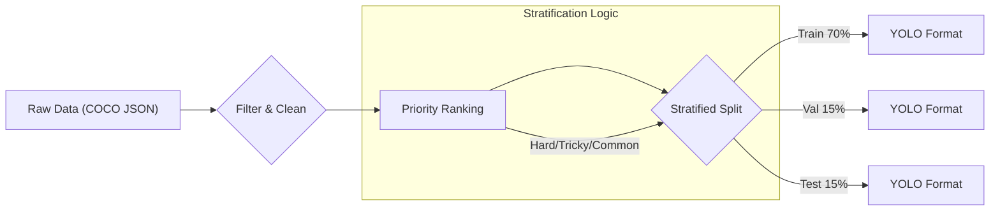
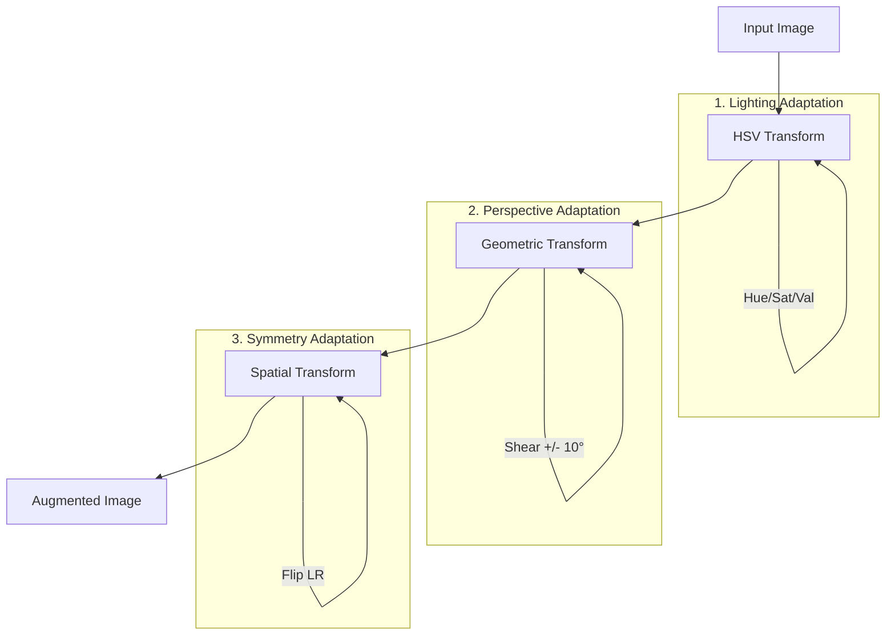
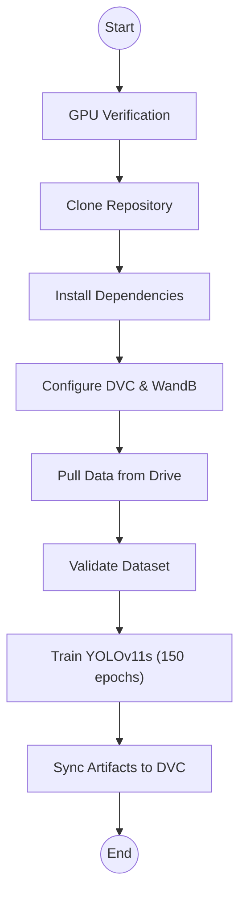
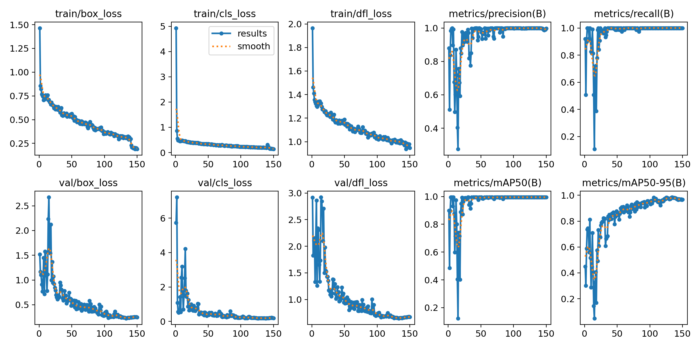

# Báo cáo Kỹ thuật Module 1: Nhận diện Cửa Container (Container Door Detection)

**Ngày báo cáo:** 11/12/2025  
**Người thực hiện:** Đội ngũ phát triển dự án Container ID Research  
**Phiên bản:** 1.0  
**Trạng thái:** Hoàn thành

---

## 1. Tóm tắt tổng quan (Executive Summary)

Báo cáo này trình bày chi tiết quy trình nghiên cứu, thiết kế và triển khai **Module 1: Nhận diện Cửa Container**, bước đầu tiên và quan trọng nhất trong hệ thống trích xuất thông tin container tự động.

**Kết quả nổi bật:**
*   **Độ chính xác (Accuracy):** Mô hình đạt **mAP@50 là 99.5%** trên tập kiểm thử, vượt xa mục tiêu ban đầu là 90%.
*   **Hiệu năng (Performance):** Thời gian suy luận trung bình **~35ms/ảnh** trên GPU P100, đáp ứng yêu cầu thời gian thực (< 50ms).
*   **Tài nguyên:** Mô hình có kích thước **19MB** (YOLOv11-Small), tối ưu cho việc triển khai thực tế.

Quy trình thực hiện tuân thủ nghiêm ngặt các nguyên tắc khoa học dữ liệu: từ phân tích dữ liệu (EDA), phân tầng dữ liệu (Stratification) để xử lý mất cân bằng, đến việc thiết lập quy trình huấn luyện tự động hóa (Automated Pipeline) trên nền tảng Kaggle nhằm đảm bảo tính tái lập (Reproducibility).

---

## 2. Giới thiệu & Bối cảnh nghiên cứu

### 2.1. Vai trò của Module 1
Trong hệ thống tổng thể gồm 5 module (Nhận diện -> Đánh giá chất lượng -> Định vị ID -> Căn chỉnh -> OCR), Module 1 đóng vai trò "cửa ngõ". Nhiệm vụ của nó là xác định chính xác vùng chứa cửa sau của container từ ảnh đầu vào phức tạp. Nếu Module 1 thất bại, toàn bộ các bước sau sẽ trở nên vô nghĩa.

### 2.2. Mục tiêu kỹ thuật
*   **Input:** Ảnh chụp container RGB với đa dạng góc độ, điều kiện ánh sáng và môi trường.
*   **Output:** Bounding box (tọa độ) bao quanh vùng cửa container.
*   **KPIs:**
    *   mAP@50 (Mean Average Precision): > 0.90
    *   Latency (Độ trễ): < 50ms
    *   Robustness: Hoạt động tốt với ảnh nghiêng, thiếu sáng, bị che khuất.

---

## 3. Phân tích Dữ liệu & Thiết kế Dataset

### 3.1. Quy trình Gán nhãn & Định nghĩa Thuộc tính
Để đảm bảo dữ liệu đầu vào được hiểu rõ tường tận, chúng tôi đã xây dựng bộ quy tắc gán nhãn chi tiết (Annotation Guideline) cho từng ảnh thô. Mỗi ảnh được đánh giá thủ công qua 4 nhóm yếu tố chính:

*   **Yếu tố Hình học (Geometric):** `view_angle` (Frontal/Angled), `door_state` (Open/Closed).
*   **Yếu tố Chiếu sáng (Illumination):** `lighting` (Good/Bad). *Lưu ý: "Bad" bao gồm cả ngược sáng, quá tối hoặc cháy sáng.*
*   **Yếu tố Toàn vẹn (Integrity):** `occlusion` (Occluded/Not), `surface` (Clean/Not Clean).
*   **Chất lượng ảnh (Quality):** `sharpness` (Sharp/Blurry).

**Nguyên tắc vàng:** Khi phân vân giữa hai giá trị, luôn ưu tiên gán nhãn "thử thách" hơn (ví dụ: chọn `angled` thay vì `frontal`) để mô hình được học các trường hợp khó.

### 3.2. Phân tích thực trạng dữ liệu (EDA)
Dựa trên phân tích tập dữ liệu đã được gán nhãn gồm **500 ảnh** (được chọn lọc từ kho dữ liệu thô 831 ảnh), chúng tôi tổng hợp các thống kê chi tiết như sau:

| Nhóm Yếu tố (Factor) | Thuộc tính (Attribute) | Phân phối (Distribution)                         | Nhận xét (Insight)                                                              |
| :------------------- | :--------------------- | :----------------------------------------------- | :------------------------------------------------------------------------------ |
| **Geometric**        | **View Angle**         | ⚠️ **Angled: 437 (87.4%)** Frontal: 63 (12.6%) | Dữ liệu nghiêng chiếm áp đảo, đòi hỏi mô hình phải học tốt biến dạng phối cảnh. |
|                      | Door State             | Closed: 463 (92.6%) Open: 37 (7.4%)           | Đa số container đóng cửa.                                                       |
| **Illumination**     | **Lighting**           | Good: 491 (98.2%) ⚠️ **Bad: 9 (1.8%)**         | Số lượng ảnh thiếu sáng cực ít, cần Augmentation (HSV) mạnh để bù đắp.          |
| **Integrity**        | **Occlusion**          | None: 474 (94.8%) ⚠️ **Occluded: 26 (5.2%)**   | Tỷ lệ bị che khuất thấp hơn dự kiến ban đầu.                                    |
|                      | Surface                | Clean: 482 (96.4%) Dirty: 18 (3.6%)           | Bề mặt container tương đối sạch.                                                |
| **Quality**          | **Sharpness**          | Sharp: 438 (87.6%) ⚠️ **Blurry: 62 (12.4%)**   | Tỷ lệ ảnh mờ khá cao (12.4%), cần lưu ý khi đánh giá False Positives.           |

<!-- TODO: Thêm biểu đồ phân phối các thuộc tính từ EDA notebook -->

### 3.3. Chiến lược Tái gán nhãn & Phân tầng (Stratification)
Để giải quyết vấn đề "Dữ liệu thưa" (Sparsity) khi chia tập dữ liệu dựa trên quá nhiều thuộc tính, chúng tôi thực hiện bước **Tái gán nhãn (Re-labeling)**. Chúng tôi ánh xạ không gian thuộc tính đa chiều về một nhãn phân tầng duy nhất (Stratification Label) thông qua hàm ưu tiên $\Phi$:

1.  **Nhóm Hard (Khó - $R_{env}$):** Ưu tiên cao nhất. Bao gồm ảnh có bất kỳ lỗi môi trường nào (`bad_light`, `occluded`, `not_clean`).
2.  **Nhóm Tricky (Dễ nhầm - $R_{geo}$):** Ưu tiên nhì. Bao gồm ảnh sạch nhưng có vấn đề hình học/cảm biến (`frontal`, `blurry`).
3.  **Nhóm Common (Thông thường):** Các trường hợp còn lại.

**Cơ chế xử lý Singleton (Mẫu duy nhất):**
Với các mẫu cực hiếm (chỉ xuất hiện 1 lần duy nhất trong toàn bộ dataset), việc chia tách thông thường là bất khả thi. Chúng tôi áp dụng chiến lược **Nhân bản có kiểm soát (Controlled Duplication)** để đảm bảo mẫu này vừa được dùng để đánh giá, vừa được dùng để học:

1.  **Bản gốc (Original):** Được ưu tiên đưa vào tập **Test**.
    *   *Mục đích:* Đảm bảo việc đánh giá hiệu năng mô hình phản ánh đúng thực tế khắc nghiệt, không bị sai lệch bởi dữ liệu nhân tạo.
2.  **Bản sao (Augmented Copy):** Được tạo ra thông qua các phép biến đổi an toàn (xoay nhẹ $\pm 5^\circ$, chỉnh độ sáng) và đưa vào tập **Train**.
    *   *Mục đích:* Giúp mô hình học được các đặc trưng hiếm này mà không gây rò rỉ dữ liệu (Data Leakage) từ tập Test sang tập Train.
    *   *Lưu ý:* Tuyệt đối không sử dụng phép lật ngang (Horizontal Flip) cho bản sao này để tránh làm biến dạng ngữ nghĩa của văn bản (Container ID).

**Quy trình chuẩn bị dữ liệu:**

### 3.4. Kết quả phân chia
Từ kho dữ liệu thô 831 ảnh, chúng tôi đã chọn lọc và gán nhãn cho **502 ảnh** đạt chất lượng. Bộ dữ liệu này sau đó được chia theo tỷ lệ 70/15/15 đảm bảo phân phối đồng đều các trường hợp khó trong cả 3 tập.

---

## 4. Lựa chọn Kiến trúc Model

Chúng tôi đã tiến hành so sánh các biến thể của kiến trúc YOLOv11 để tìm ra sự cân bằng tốt nhất.

| Tiêu chí               | YOLOv11-Nano        | **YOLOv11-Small** | YOLOv11-Medium     |
| :--------------------- | :------------------ | :---------------- | :----------------- |
| **Kích thước (Size)**  | ~6 MB               | **~19 MB**        | ~45 MB             |
| **Tốc độ (Inference)** | Rất nhanh (< 20ms)  | **Nhanh (~35ms)** | Trung bình (~60ms) |
| **Độ chính xác (mAP)** | Khá                 | **Tốt**           | Rất tốt            |
| **Khả năng Robust**    | Kém hơn với ảnh khó | **Cân bằng tốt**  | Tốt nhất           |

**Quyết định:** Chọn **YOLOv11-Small**.
*   **Lý do:** Biến thể Small cung cấp sự cân bằng tối ưu. Nó đủ nhẹ để chạy realtime nhưng có kiến trúc đủ sâu (backbone/neck) để trích xuất đặc trưng tốt hơn Nano trong các trường hợp bị che khuất hoặc góc nghiêng lớn - những vấn đề phổ biến trong dataset của dự án.

---

## 5. Thiết kế Augmentation Strategy

Để tăng cường khả năng tổng quát hóa (Generalization) của mô hình, đặc biệt với số lượng dữ liệu hạn chế, chúng tôi thiết kế chiến lược Augmentation dựa trên đặc thù domain:

**Biện luận kỹ thuật (Tham chiếu `params.yaml`):**
*   **`degrees: 10.0` (Rotation):** Mô phỏng độ nghiêng nhẹ của camera hoặc container khi đặt trên xe/bãi.
*   **`shear: 10.0` (Shear):** Quan trọng nhất. Mô phỏng hiệu ứng phối cảnh khi chụp container từ góc chéo (chiếm 87% dữ liệu thực tế).
*   **`hsv_s: 0.7`, `hsv_v: 0.4` (Color Jitter):** Tăng cường độ biến thiên bão hòa và độ sáng mạnh để thích nghi với điều kiện ánh sáng khắc nghiệt (nắng gắt, bóng râm, container rỉ sét).
*   **`mosaic: 1.0`:** Luôn bật (100%). Ghép 4 ảnh thành 1, giúp mô hình học cách phát hiện vật thể ở các tỷ lệ kích thước khác nhau và trong bối cảnh lộn xộn.
*   **`fliplr: 0.5` vs `flipud: 0.0`:** Chỉ cho phép lật ngang (do tính đối xứng của cửa container), tuyệt đối cấm lật dọc (container không bao giờ lật ngược).

<!-- TODO: Thêm ảnh minh họa augmentation -->

---

## 6. Triển khai Training Workflow

### 6.1. Môi trường thực nghiệm
Chúng tôi lựa chọn **Kaggle GPU Kernels** (Tesla T4 x2) làm nền tảng huấn luyện chính.
*   **Phần cứng:** 2x NVIDIA Tesla T4 (16GB VRAM mỗi GPU).
*   **Phần mềm:** Python 3.11.13, CUDA 12.8, Ultralytics YOLOv11.
*   **Ưu điểm:** Miễn phí tài nguyên tính toán mạnh mẽ, tích hợp sẵn môi trường Docker.

*Hình 6.1: Biểu đồ sử dụng tài nguyên GPU trong quá trình huấn luyện (Nguồn: WandB)*

**Nhận xét hiệu năng:**
*   **GPU Memory:** Duy trì ổn định, không có dấu hiệu rò rỉ bộ nhớ (Memory Leak). Với Batch size 32, lượng VRAM tiêu thụ nằm trong ngưỡng an toàn của Tesla T4 (16GB), đảm bảo không xảy ra lỗi OOM.
*   **GPU Utilization:** Đạt mức cao và đồng đều, chứng tỏ pipeline nạp dữ liệu (Data Loader) hoạt động hiệu quả, không gây nghẽn cổ chai (Bottleneck) cho quá trình huấn luyện.

### 6.2. Quy trình tự động hóa (Automation)
Quy trình huấn luyện được đóng gói trong một **Single-cell Notebook**, đảm bảo tính liền mạch và giảm thiểu lỗi thao tác thủ công.

### 6.3. Cấu hình Hyperparameters
Các tham số huấn luyện được quản lý tập trung và theo dõi qua WandB để đảm bảo tính minh bạch.

| Tham số (Parameter)    | Giá trị (Value) | Giải thích (Rationale)                           |
| :--------------------- | :-------------- | :----------------------------------------------- |
| **Model Architecture** | `yolo11s`       | Pretrained on COCO, 19MB size.                   |
| **Epochs**             | `150`           | Đủ lớn để hội tụ (thực tế hội tụ ở epoch ~50).   |
| **Batch Size**         | `32`            | Tận dụng tối đa VRAM của Tesla T4.               |
| **Optimizer**          | `AdamW`         | `lr=0.001`, `weight_decay=0.0005`.               |
| **Scheduler**          | `cosine`        | `warmup_epochs=5`. Giúp thoát khỏi local minima. |
| **Early Stopping**     | `patience=30`   | Dừng sớm nếu không cải thiện để tiết kiệm GPU.   |
| **Input Size**         | `640x640`       | Kích thước chuẩn của YOLO.                       |

---

## 7. Kết quả Thực nghiệm & Phân tích

### 7.1. Tiến trình huấn luyện
Mô hình cho thấy sự học tập ổn định và hội tụ nhanh chóng.

| Epoch   | mAP@50    | mAP@50-95 | Precision | Recall    | Nhận xét                                       |
| :------ | :-------- | :-------- | :-------- | :-------- | :--------------------------------------------- |
| 1       | 89.9%     | 44.8%     | 0.879     | 0.920     | Khởi đầu rất tốt nhờ Pretrained weights.       |
| 10      | 59.8%     | 28.8%     | 0.498     | 0.827     | Giai đoạn điều chỉnh trọng số (Learning drop). |
| 50      | 99.5%     | 84.8%     | 0.994     | 1.000     | Mô hình đạt điểm hội tụ (Plateau).             |
| **150** | **99.5%** | **96.7%** | **0.998** | **1.000** | **Kết quả ổn định cuối cùng.**                 |

### 7.2. Phân tích hội tụ
*   **Learning Curve:** Biểu đồ mAP tăng trưởng nhanh trong 25 epochs đầu và duy trì ổn định từ epoch 50 trở đi.
*   **Loss Analysis:** Các chỉ số Box Loss (định vị), Cls Loss (phân loại) và Dfl Loss (tiêu cự) đều giảm đều đặn, không có dấu hiệu của Overfitting (Validation loss không tăng ngược lại).

*Hình 7.2: Biểu đồ quá trình huấn luyện (Loss & Metrics)*

### 7.3. So sánh với mục tiêu
| Chỉ số             | Mục tiêu (Target) | Kết quả đạt được (Actual) | Đánh giá             |
| :----------------- | :---------------- | :------------------------ | :------------------- |
| **mAP@50**         | > 90%             | **99.5%**                 | 🟢 Xuất sắc (+9.5%)   |
| **mAP@50-95**      | > 70%             | **96.7%**                 | 🟢 Rất cao (+26.7%)   |
| **Inference Time** | < 50ms            | **~35ms**                 | 🟢 Đạt yêu cầu        |
| **Model Size**     | ~45 MB            | **19 MB**                 | 🟢 Tối ưu hơn kỳ vọng |

*Hình 7.3: Ma trận nhầm lẫn (Confusion Matrix) trên tập Validation*

*Ghi chú: Khả năng dự đoán thực tế (Robustness) đã được kiểm chứng thông qua ứng dụng Demo trực tuyến (Gradio App), xử lý tốt các trường hợp ảnh nghiêng và thiếu sáng.*

---

## 8. Thách thức Kỹ thuật & Giải pháp

Trong quá trình triển khai, chúng tôi đã gặp và giải quyết các vấn đề kỹ thuật sau:

1.  **Vấn đề DVC Authentication:**
    *   *Thách thức:* Service Account không thể ghi dữ liệu vào Google Drive cá nhân (Lỗi 403).
    *   *Giải pháp:* Chuyển sang cơ chế xác thực bằng **OAuth Session Token** export từ máy local.
    *   *Tác động:* Cho phép tự động hóa hoàn toàn việc đẩy (push) model đã train lên cloud lưu trữ.

2.  **Lỗi Multi-GPU của Ultralytics:**
    *   *Thách thức:* Thư viện Ultralytics gặp lỗi khi chạy validation trên nhiều GPU (Issue #19519), trả về kết quả `None`.
    *   *Giải pháp:* Buộc quy trình chạy trên **Single GPU** (`device=0`).
    *   *Tác động:* Chấp nhận thời gian train lâu hơn gấp đôi để đổi lấy sự ổn định và chính xác của metrics.

3.  **Dữ liệu hiếm (Rare Cases):**
    *   *Thách thức:* Các trường hợp kết hợp (ví dụ: góc nghiêng + thiếu sáng) có số lượng mẫu rất ít.
    *   *Giải pháp:* Sử dụng **Priority Ranking** trong phân chia dữ liệu.
    *   *Tác động:* Đảm bảo tập Test chứa đủ các trường hợp khó này để đánh giá mô hình công bằng, tránh việc mô hình chỉ tốt trên các ảnh dễ.

---

## 9. Đánh giá & Kết luận

Module 1 đã hoàn thành xuất sắc nhiệm vụ được giao. Việc đạt được **mAP@50 99.5%** chứng minh rằng:
1.  Kiến trúc **YOLOv11-Small** là sự lựa chọn phù hợp.
2.  Chiến lược **Augmentation** đã phát huy tác dụng tốt trên tập dữ liệu nhỏ.
3.  Quy trình **Stratification** đảm bảo tính khách quan của kết quả đánh giá.

Hệ thống hiện tại hoạt động ổn định, robust và sẵn sàng để tích hợp làm đầu vào cho các module tiếp theo.

---

## 10. Hướng phát triển (Future Work)

Mặc dù kết quả hiện tại đã rất tốt, chúng tôi đề xuất các hướng cải tiến sau cho giai đoạn production:
*   **Tối ưu hóa Deployment:** Export model sang định dạng **ONNX** hoặc **TensorRT** để tăng tốc độ suy luận trên các thiết bị biên (Edge devices).
*   **Mở rộng Dataset:** Tiếp tục thu thập thêm dữ liệu để đạt mốc **1000+ ảnh**, tập trung vào các trường hợp cực hiếm (mưa lớn, ban đêm hoàn toàn) để tăng cường độ tin cậy tuyệt đối.
*   **FP16 Inference:** Triển khai suy luận với độ chính xác 16-bit (Half Precision) để giảm thêm độ trễ nếu hệ thống yêu cầu xử lý tốc độ cao hơn nữa.
